<div align="center">

# 🧭 Module 0 — Orientation: the Ecosystem and the FDE Mindset

**GraphSmith Academy · LangChain Track · ⏱️ ~35 minutes**

*Know exactly which package does what, set up a clean project, and learn the seven-layer debugging model you will use for the rest of the course.*

</div>

---

## 📑 Table of contents

- [0.0 Before we start: the absolute basics](#00-before-we-start-the-absolute-basics)
- [0.1 What you are actually learning](#01-what-you-are-actually-learning)
- [0.2 The ecosystem map](#02-the-ecosystem-map)
- [0.3 Versions: what changed with 1.0](#03-versions-what-changed-with-10)
- [0.4 Set up a clean project](#04-set-up-a-clean-project)
- [0.5 The FDE mindset: seven layers](#05-the-fde-mindset-seven-layers)
- [0.6 How to work through this course](#06-how-to-work-through-this-course)
- [🐞 Bug hunt: three real failures](#-bug-hunt-three-real-failures)
- [🎤 Interview questions](#-interview-questions)
- [📝 Self-check exam](#-self-check-exam)
- [🛠️ Milestone project](#️-milestone-project-repo-skeleton-and-sanity-check)
- [📖 Glossary](#-glossary)
- [🗺️ One-page summary](#️-one-page-summary)

---

## 0.0 Before we start: the absolute basics

> [!NOTE]
> This section is not in the original module. It exists so that someone who has **never** touched LangChain, LangSmith or an AI API can follow everything that comes after. If you already know what an LLM, an API key and a token are, skip to [0.1](#01-what-you-are-actually-learning).

### What is an LLM?

An **LLM (Large Language Model)** is a program trained on huge amounts of text. You give it text, and it predicts what text should come next. GPT‑4.1, Claude, Gemini and Llama are all LLMs.

Think of it as a **very well-read assistant locked in a room with no memory and no internet**. You slide a note under the door, it writes a reply and slides it back. It does not remember the previous note unless you include it again. It cannot look anything up unless you hand it the information.

### How does your code talk to an LLM?

Most LLMs run on the provider's servers (OpenAI, Anthropic, Google…). Your program sends a request over the internet to the provider's **API** (Application Programming Interface, basically a door other programs can knock on) and gets a reply back.

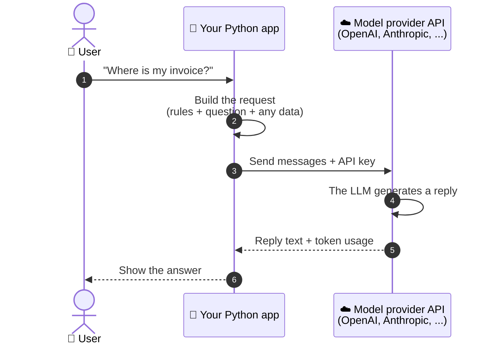

A few words you will see constantly:

| Term | Plain-English meaning |
|---|---|
| **Prompt** | The text (instructions + question + data) you send to the model. |
| **Token** | A chunk of text, roughly ¾ of an English word. Providers charge per token, and models have a maximum number of tokens they can read at once. |
| **API key** | A secret password that proves the request comes from your paid account. Anyone with it can spend your money, so it must never be shared or committed to GitHub. |
| **Temperature** | A dial for randomness. `0` = as predictable as possible. Higher = more creative and varied. |
| **SDK** | "Software Development Kit": a library a provider publishes so you can call their API from Python without writing raw HTTP requests. |

### What are LangChain, LangGraph and LangSmith, in one sentence each?

- **LangChain** — a Python (and JavaScript) library that gives you **one standard way** to talk to any model, define tools, and build agents.
- **LangGraph** — the **engine** underneath that runs multi-step AI workflows reliably: it remembers state, can pause and resume, and can loop.
- **LangSmith** — a **website/service** that records every step your AI app takes (a "trace") so you can see exactly what happened, test quality, and deploy.

All three are made by the same company, LangChain Inc. You will understand how they fit together by the end of [0.2](#02-the-ecosystem-map).

### What is an "agent"?

A normal program follows steps you wrote in advance. An **agent** is a program where the **LLM decides what to do next**: which tool to call, with what input, and when it is finished.

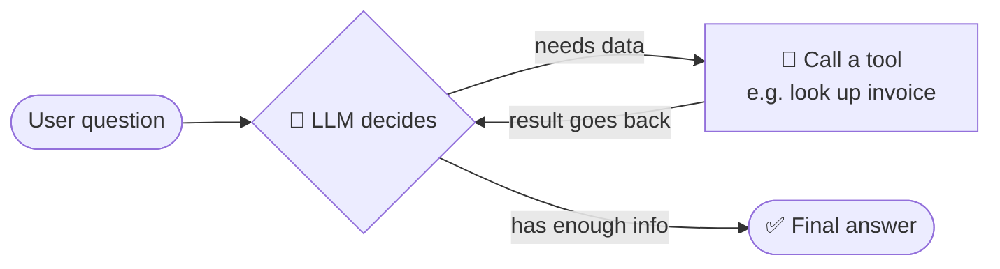

### What is a "tool"?

A **tool** is just a normal function (for example `get_invoice(customer_id)`) that you describe to the model. The model cannot run code itself. It *asks* for the tool to be called, your program runs it, and the result is sent back to the model.

### What is an FDE?

**FDE = Forward Deployed Engineer.** An engineer who works directly with a customer, turns a fuzzy business problem ("our support team is drowning") into a working AI system, and keeps it working after launch. This course trains you to think like one. More in [0.5](#05-the-fde-mindset-seven-layers).

---

## 0.1 What you are actually learning

Every LLM application, from a one-line chatbot to a fleet of cooperating agents, is built from the **same five ingredients**:

| # | Ingredient | What it means | Everyday analogy |
|---|---|---|---|
| 1 | 🧠 **Model** | The LLM that reads text and writes text. | The brain. |
| 2 | 📚 **Context** | Everything you put in front of the model on this call: instructions, chat history, retrieved documents. | The papers on the desk. |
| 3 | 🔧 **Tools** | Functions the model can ask you to run: search, database lookups, sending an email. | The hands. |
| 4 | 💾 **State** | What you remember between steps: messages so far, intermediate results, user ID. | The notebook. |
| 5 | 🔀 **Control flow** | The logic deciding what happens next: call a tool? ask a human? stop? | The to-do list and the decision rules. |

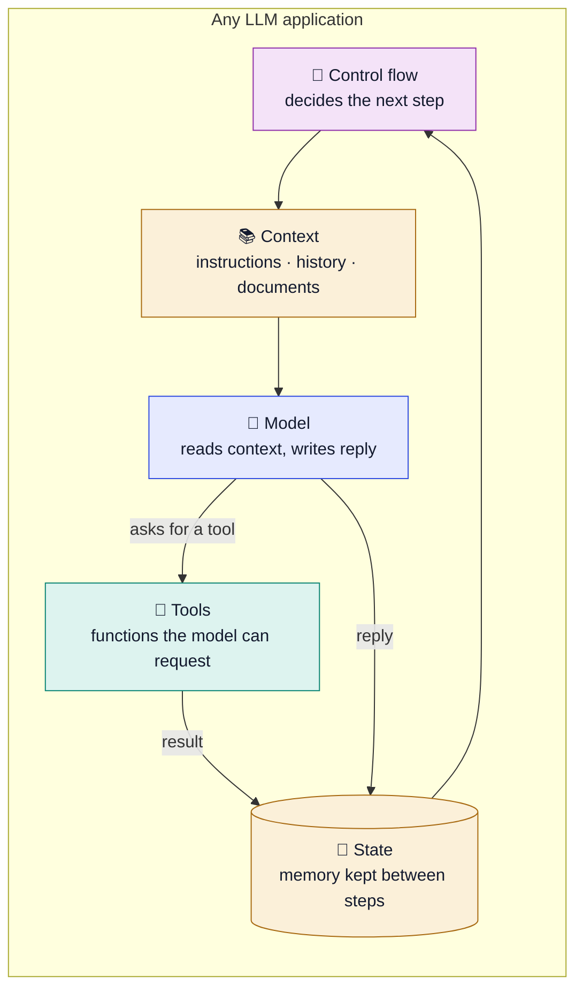

> [!IMPORTANT]
> **The one sentence to remember:** LangChain gives you **standard interfaces** for those ingredients. LangGraph gives you a **runtime** that runs them reliably.

### "Why not just call the OpenAI SDK directly?"

You *could* write everything with a raw provider SDK, and for a single prompt to a single model that is perfectly fine. Teams stop doing it once real-world needs pile up:

| Real-world need | With a raw SDK you must build… | With LangChain / LangGraph |
|---|---|---|
| Swap OpenAI for Anthropic or a local model | Rewrite every call; message formats differ per vendor | Change one string, e.g. `"openai:gpt-4.1-mini"` → `"anthropic:..."` |
| Stream words to a UI as they are generated | Custom streaming code per provider, per step | Built-in streaming, even through nested steps |
| Pause and wait for a human to approve an action | Your own pause/resume system and storage | `interrupt` + a checkpointer |
| Resume after a crash halfway through a 20-step task | Your own persistence layer | Checkpointers save state after each step |
| Find out why run number 48,213 went wrong last Tuesday | Your own logging of every prompt, tool call and output | LangSmith traces every step automatically |

That is the job these frameworks do: they handle the plumbing so you can focus on the problem.

---

## 0.2 The ecosystem map

The word "LangChain" is used loosely, but it is actually **a family of separate Python packages** stacked on top of each other, plus a hosted service (LangSmith). Here is the 2026 picture. Read the arrows as **"is built on"**.

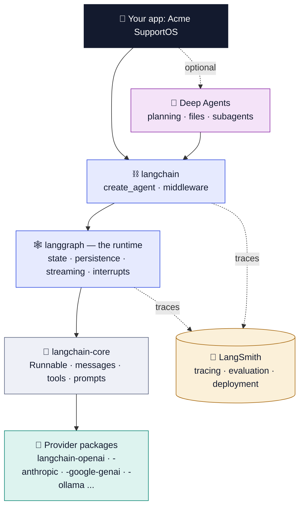
<p align="center"><sub>The 2026 LangChain ecosystem. Solid arrows mean "is built on"; dotted arrows to LangSmith mean "sends traces to".</sub></p>

### Walking the stack from bottom to top

1. **Provider packages** (`langchain-openai`, `langchain-anthropic`, …) — the adapters. Each one knows how to talk to one vendor's API and translate it into LangChain's standard shape. You install only the ones you use.
2. **`langchain-core`** — the foundation. It defines the *shapes* everything else agrees on: what a message looks like, what a tool looks like, what a prompt template is, and the **Runnable** interface (anything you can `.invoke()`, `.stream()` or `.batch()`). It is small and has very few dependencies.
3. **`langgraph`** — the runtime. It runs your steps as a **graph** (boxes connected by arrows), keeps **state** between steps, saves progress (**persistence**), streams output, and can **pause** for a human (interrupts).
4. **`langchain`** — the friendly top layer. It gives you `init_chat_model` (get any model with one line) and `create_agent` (a working agent with one function call), plus **middleware** to customise agents.
5. **Deep Agents** (`deepagents`) — a ready-made "harness" on top of `langchain` for long, open-ended tasks. It adds planning, a virtual file system and sub-agents.
6. **LangSmith** — not part of the stack, but **beside** it. Every layer can send traces to it.

### Package reference table

| Package | What lives there | You reach for it when |
|---|---|---|
| `langchain-core` | Base interfaces: **Runnable**, message classes, prompt templates, tool schema | Always installed; everything depends on it |
| `langchain` | `init_chat_model`, `create_agent`, **middleware**, structured-output strategies | You want a working agent quickly, with guardrails |
| `langchain-openai` etc. | One package per provider integration | You pick a model vendor |
| `langgraph` | `StateGraph`, reducers, checkpointers, `interrupt`, `Command`, `Send`, streaming | You need custom control flow, loops, persistence, human-in-the-loop |
| `langchain-classic` | Legacy chains and `AgentExecutor` | Maintaining old code only. 🚫 **Do not start new work here.** |
| LangSmith | Tracing, datasets, evaluations, prompt hub, deployment | From day one. You cannot debug what you cannot see. |
| `deepagents` | An agent harness with planning, a virtual filesystem and subagents, built on LangChain | Long, open-ended tasks such as research or coding |

> [!TIP]
> **Why are providers separate packages?** So that each integration can release on its own schedule with its own dependencies. When OpenAI ships a new feature, `langchain-openai` can update without waiting for a core release, and you never have to install Google's libraries just to use OpenAI.

### The key idea: `create_agent` *is* a LangGraph graph

> [!IMPORTANT]
> `create_agent` in LangChain 1.x **compiles to a LangGraph graph**. So everything you learn about LangGraph state, checkpointers and streaming also applies to agents you built with one line of LangChain. That is why the course teaches both.

Here is what that one line of code builds for you behind the scenes:

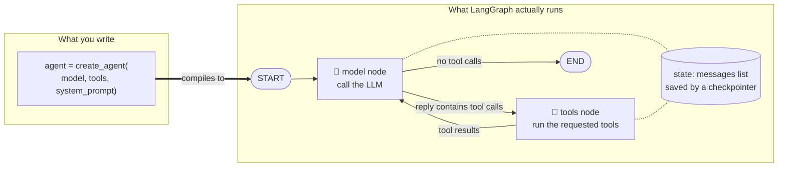

**Rule of thumb:** start with `create_agent`. Drop down to writing your own `StateGraph` when you need custom control flow, deterministic steps mixed with LLM steps, or multi-agent orchestration.

---

## 0.3 Versions: what changed with 1.0

LangChain and LangGraph both reached **version 1.0 in October 2025**, and they follow **semantic versioning** since then.

> [!NOTE]
> **Semantic versioning in 20 seconds.** A version looks like `MAJOR.MINOR.PATCH`, e.g. `1.4.2`.
> - `PATCH` (1.4.**2**) — bug fixes only.
> - `MINOR` (1.**4**.0) — new features, nothing breaks.
> - `MAJOR` (**1**.0.0 → **2**.0.0) — things may break.
>
> So "1.x until 2.0" means: **code you write for 1.0 should keep working on every 1.x release.**

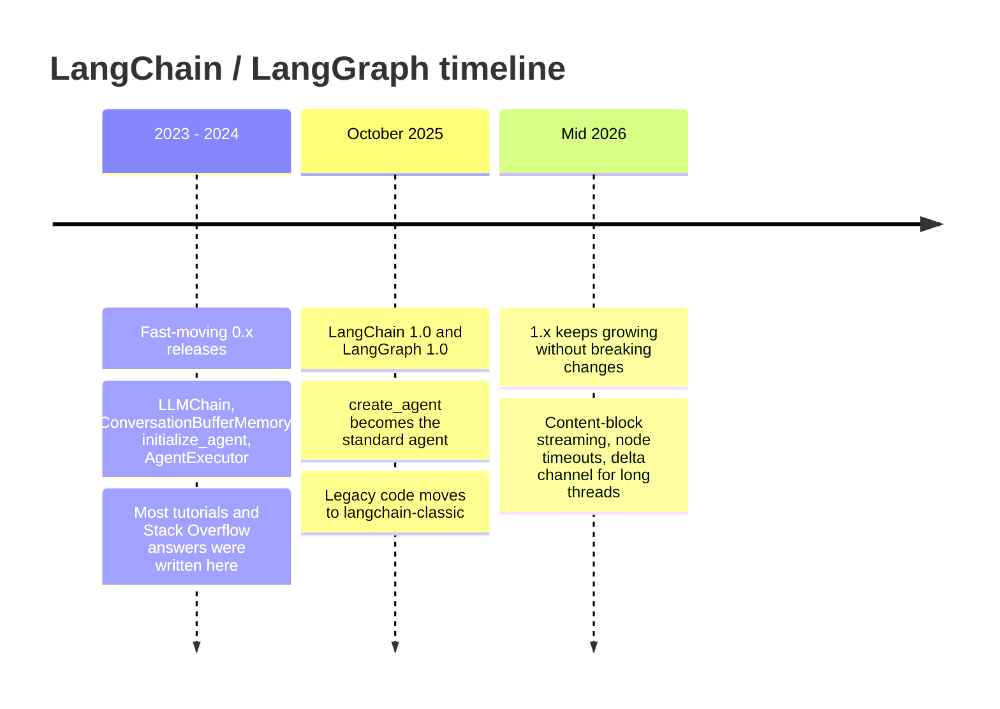

### The practical consequences for you

| What changed | What it means in practice |
|---|---|
| ✅ **`create_agent`** replaced `AgentExecutor` and `langgraph.prebuilt.create_react_agent` | There is now *one* standard way to build an agent. |
| ✅ **Middleware** is how you customise agents | Want summarisation of long chats, human approval, PII redaction, retries or a fallback model? Plug in a middleware instead of rewriting the agent. |
| ✅ **Standard content blocks** (`message.content_blocks`) | Text, reasoning, tool calls and images come back in **one shape** no matter which provider you use. |
| ⚠️ **LCEL pipes** (`prompt \| model`) still work | …but they are now for simple, straight-line chains. Agents and anything with memory go through LangGraph. |
| 🐍 **Python 3.10 or newer** is required | Python 3.9 support was dropped while preparing 1.0. Check with `python --version`. |

**What is middleware?** Picture the agent as a factory line. Middleware is a station you bolt onto the line that inspects or changes things as they pass, without rebuilding the factory.

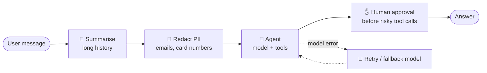

### Old API → new API cheat sheet

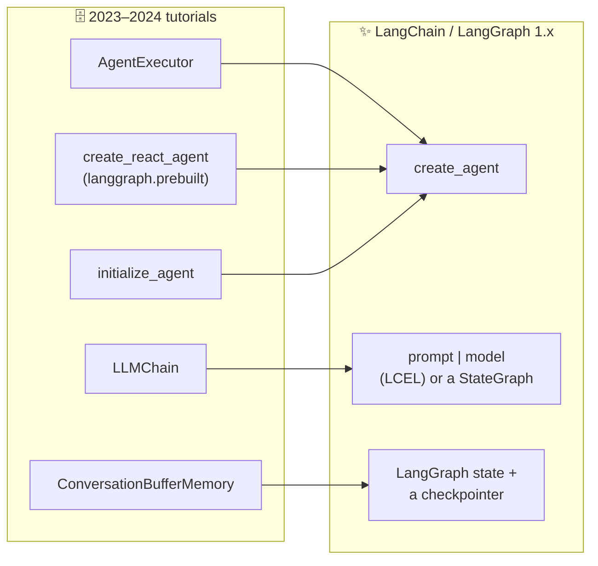

> [!WARNING]
> **Pitfall: old tutorials.** Most blog posts and Stack Overflow answers from 2023–2024 use APIs that moved or were deprecated (`LLMChain`, `ConversationBufferMemory`, `initialize_agent`). If a snippet imports those, treat it as history. Always check the date, and check the official docs at **docs.langchain.com**.

---

## 0.4 Set up a clean project

We will build one realistic project across the whole course: **Acme SupportOS**, a customer-support assistant for a fictional company called Acme Cloud. In this module you only create the skeleton and prove that you can call a model and see the trace.

### The setup at a glance

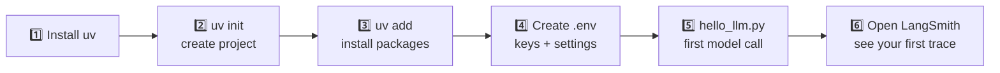

### Step 1–3: create the project and install packages

**`uv`** is a fast Python package and project manager. It creates an isolated **virtual environment** (a private folder of packages just for this project, so projects do not clash) and records exact versions in a **lock file**.

```bash
# terminal
# one-time: install uv (fast Python package manager)
# see https://docs.astral.sh/uv/ for the install command for your OS

uv init acme-supportos && cd acme-supportos
uv add langchain langchain-openai langgraph langsmith python-dotenv
uv add --dev pytest ruff
```

What each line does:

| Command | What it does |
|---|---|
| `uv init acme-supportos` | Creates a new folder with a `pyproject.toml` (the project's settings and dependency list). |
| `cd acme-supportos` | Moves into that folder. |
| `uv add langchain …` | Installs the packages and writes their exact versions into `uv.lock`. |
| `langchain` | `init_chat_model`, `create_agent`, middleware. |
| `langchain-openai` | The adapter for OpenAI models. |
| `langgraph` | The runtime. |
| `langsmith` | The client that sends traces to LangSmith. |
| `python-dotenv` | Reads your `.env` file into environment variables. |
| `uv add --dev pytest ruff` | Developer-only tools: `pytest` runs tests, `ruff` checks code style. They are not shipped with the app. |

> [!TIP]
> Not using `uv` yet? The rough equivalent is `python -m venv .venv`, activate it, then `pip install langchain langchain-openai langgraph langsmith python-dotenv`. The course uses `uv` because it gives you a lock file for free.

### Step 4: the `.env` file (your secrets and settings)

An **environment variable** is a named value that lives outside your code (for example `OPENAI_API_KEY`). Keeping secrets there means they never end up in your source code.

```bash
# .env  (never commit this file; commit .env.example with empty values)
OPENAI_API_KEY=sk-...
LANGSMITH_TRACING=true
LANGSMITH_API_KEY=lsv2_...
LANGSMITH_PROJECT=acme-supportos-dev
MODEL=openai:gpt-4.1-mini
```

| Variable | Purpose |
|---|---|
| `OPENAI_API_KEY` | Your OpenAI secret key (from platform.openai.com). |
| `LANGSMITH_TRACING=true` | Turns on automatic tracing for all LangChain/LangGraph code. |
| `LANGSMITH_API_KEY` | Your LangSmith secret key (from smith.langchain.com). |
| `LANGSMITH_PROJECT` | Which LangSmith project the traces go into. Separate `-dev` and `-prod` projects keep things tidy. |
| `MODEL` | Which model to use, in `provider:model-name` format. Changing models becomes a one-line config change. |

**Secret hygiene, visually:**

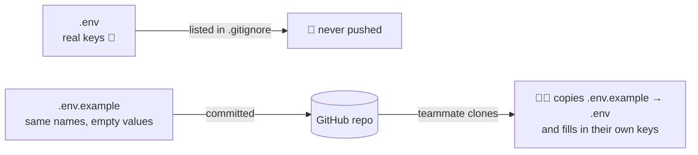

### Step 5: your first model call — `scripts/hello_llm.py`

```python
# scripts/hello_llm.py
from dotenv import load_dotenv
load_dotenv()                      # load keys BEFORE creating any model

import os
from langchain.chat_models import init_chat_model

model = init_chat_model(os.environ["MODEL"], temperature=0)
reply = model.invoke("Say hello to Acme Cloud's support team in one sentence.")
print(reply.text)                  # the plain text
print(reply.usage_metadata)        # {'input_tokens': .., 'output_tokens': .., 'total_tokens': ..}
```

Line by line:

| Line | What it does |
|---|---|
| `load_dotenv()` | Reads `.env` and puts every line into the environment. **It must run first** (see the bug hunt below for what happens otherwise). |
| `init_chat_model(os.environ["MODEL"], temperature=0)` | Creates a chat-model object for whatever `MODEL` says. `temperature=0` makes replies as consistent as possible, which is what you want while testing. |
| `model.invoke("…")` | Sends one message to the model and waits for the full reply. `invoke` is the standard "run it once" method on every Runnable. |
| `reply.text` | The reply as plain text. `reply` is an `AIMessage` object, not a string. |
| `reply.usage_metadata` | How many tokens went in and out. Tokens = cost, so you watch this from day one. |

Run it with:

```bash
uv run python scripts/hello_llm.py
```

### Why the order of `load_dotenv()` matters

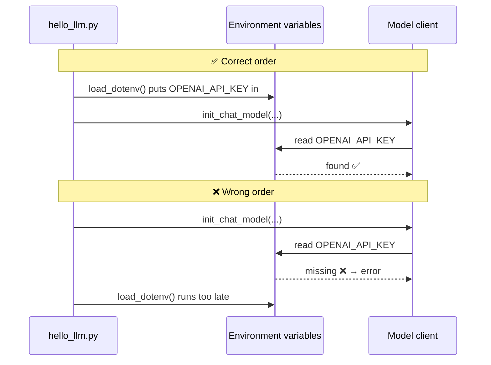

### Step 6: see your first trace in LangSmith

A **trace** is a recorded tree of everything that happened during one run: every model call, every tool call, their inputs and outputs, how long each took and how many tokens each used.

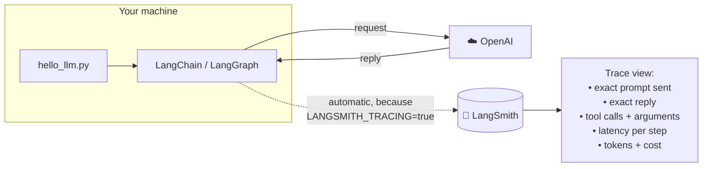

> [!TIP]
> **FDE habit:** turn on LangSmith tracing **before you write your second line of code**. Every later module assumes you can open a trace and read the exact prompt, tool calls, latency and token cost of any run.

> [!NOTE]
> **LangSmith does not require LangChain.** You can trace any Python code with the `@traceable` decorator, or wrap a provider client (for example `wrap_openai`). With LangChain/LangGraph you get it automatically just from the two environment variables.

---

## 0.5 The FDE mindset: seven layers

A **Forward Deployed Engineer** sits with a customer, turns a vague problem into a working system, and keeps it working in production. The skill that separates great FDEs is **diagnosis**.

When the customer says *"the bot gives wrong answers sometimes"*, a beginner opens the prompt and starts rewriting it. An FDE first asks: **"Which layer is actually broken?"** — and uses the trace to find out.

### The seven layers

Every request flows through these seven layers, left to right. A failure can hide in any of them.

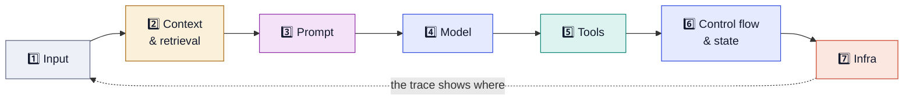
<p align="center"><sub>The seven layers you will check, in order, every time something breaks.</sub></p>

| Layer | What it is | Typical failure | First thing you check |
|---|---|---|---|
| **1 · Input** | What the user (or upstream system) actually sent. | Ambiguous or malformed input, wrong encoding | The **raw input** in the trace |
| **2 · Context** | The extra information you gather for the model: retrieved documents, chat history. | Retriever returns the wrong chunks; history got truncated | The **retrieved documents** and the **message list** sent to the model |
| **3 · Prompt** | The final text the model sees after your template is filled in. | Contradicting instructions; missing output-format spec | The **rendered** prompt — not the template |
| **4 · Model** | The LLM itself and its settings. | Model too weak for the task; wrong temperature; context window overflow | **Swap models** on the same input and compare |
| **5 · Tools** | The functions the model can call. | Bad tool descriptions; hallucinated (made-up) arguments; exceptions | The **tool-call arguments** and the **ToolMessage** returned |
| **6 · Control flow & state** | The graph: which step runs next, and what is remembered. | Loops forever; takes the wrong branch; state overwritten | The **graph path** and the **state at each step** |
| **7 · Infra** | Everything around the code: servers, API limits, databases, package versions. | Rate limits; timeouts; memory lost between workers; broken dependencies | **Logs, error rates**, the checkpointer backend |

> [!TIP]
> **"Rendered prompt, not the template"** matters a lot. Your template might look perfect, but the version actually sent can have an empty variable, a 40-page document pasted in, or two instructions that contradict each other. Only the trace shows the real thing.

### A quick decision guide

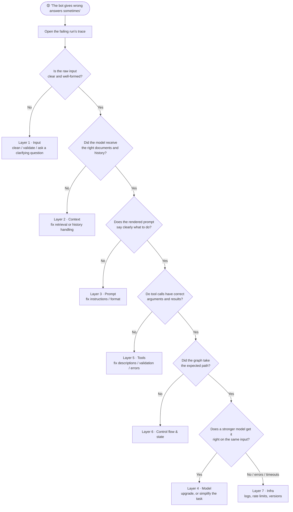

### The debugging loop

<div align="center">

**Reproduce → Localise → Hypothesise → Isolate → Fix → Add a regression test**

</div>

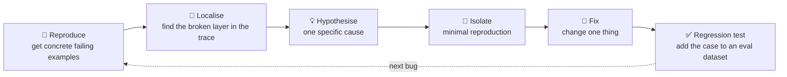

| Step | What you do | Why |
|---|---|---|
| **Reproduce** | Collect real failing inputs and the answers the customer expected. | "Sometimes wrong" cannot be fixed. Five concrete examples can. |
| **Localise** | Use the trace to find which of the seven layers broke. | Stops you from fixing the wrong thing. |
| **Hypothesise** | Form *one* specific guess ("the retriever returns last year's pricing doc"). | One guess at a time keeps you honest. |
| **Isolate** | Build the smallest possible reproduction. | Proves the guess and makes the fix fast to test. |
| **Fix** | Change one thing. | If you change five things, you will not know which one worked. |
| **Regression test** | Add the failing case to a dataset that runs every time. | A **regression** is an old bug coming back. This makes sure it can't. |

Every module has a **🐞 Bug hunt** section that drills this exact loop on realistic failures.

### Workflow or agent? An FDE question

Part of the mindset is knowing when **not** to build an agent.

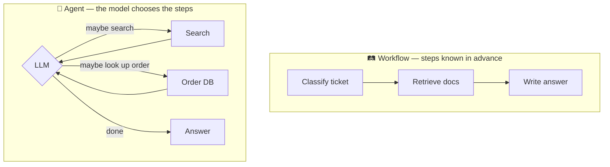

| | Workflow | Agent |
|---|---|---|
| Steps | Fixed, known ahead of time | Decided by the model at run time |
| Cost & speed | Cheaper, faster | More model calls, slower |
| Testing | Easy, predictable | Harder, less predictable |
| Use when | You can draw the flowchart in advance | The model must decide *which* steps and *how many* |

Many production systems are **workflows with one or two agentic steps inside**.

---

## 0.6 How to work through this course

Each module follows the same loop:

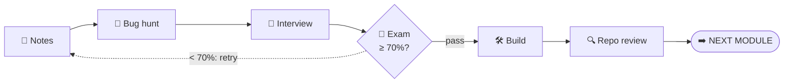
<p align="center"><sub>Fail the exam and you loop back to the notes. Pass it and the next module unlocks.</sub></p>

1. **Read the notes and type out every code sample yourself.** Do not copy-paste — typing builds muscle memory and surfaces questions.
2. **Do the bug hunt before looking at answers.** Write your diagnosis first.
3. **Answer the interview questions aloud** as if a panel is listening.
4. **Pass the exam at 70%.** Questions reshuffle on every attempt.
5. **Push the milestone to your repo**, then request a review. Your score lands in the Build tab.

---

## 🐞 Bug hunt: three real failures

Try to diagnose each one yourself (which layer? what's the cause?) before opening the answer.

### Bug 1 — "The import that worked in every tutorial"

**Symptom:** right after upgrading to LangChain 1.x:

```
ImportError: cannot import name 'AgentExecutor' from 'langchain.agents'
```

```python
from langchain.agents import AgentExecutor, create_tool_calling_agent
from langchain_openai import ChatOpenAI

llm = ChatOpenAI(model="gpt-4.1-mini")
agent = create_tool_calling_agent(llm, tools, prompt)
executor = AgentExecutor(agent=agent, tools=tools)
```

<details>
<summary><b>💡 Show diagnosis and fix</b></summary>

**Layer 7 (environment).** In LangChain 1.x the `langchain` package was slimmed down around `create_agent`. The legacy `AgentExecutor` moved to `langchain-classic` and is deprecated.

**Fix:** use the new standard agent. Only install `langchain-classic` if you are maintaining old code you cannot migrate yet.

```python
from langchain.agents import create_agent

agent = create_agent(model="openai:gpt-4.1-mini", tools=tools,
                     system_prompt="You are Acme Cloud's support assistant.")
result = agent.invoke({"messages": [{"role": "user", "content": "Where is my invoice?"}]})
```

Notice how much simpler it is: the model is a string, there is no separate executor, and the input is a plain list of messages.

</details>

### Bug 2 — "The key is right there in .env"

**Symptom:**

```
OpenAIError: The api_key client option must be set
```

…even though `.env` clearly contains `OPENAI_API_KEY`.

```python
import os
from langchain.chat_models import init_chat_model
from dotenv import load_dotenv

model = init_chat_model("openai:gpt-4.1-mini")
load_dotenv()
print(model.invoke("hi").text)
```

<details>
<summary><b>💡 Show diagnosis and fix</b></summary>

**Layer 7.** The provider client reads the API key from the environment **when the model object is created**. `load_dotenv()` runs one line too late, so the variable does not exist yet. (See the sequence diagram in [0.4](#why-the-order-of-load_dotenv-matters).)

**Fix:** load the environment first thing in your entry point, before creating any model, and **fail fast** with a clear message if a required key is missing.

```python
from dotenv import load_dotenv
load_dotenv()

import os
assert os.getenv("OPENAI_API_KEY"), "Set OPENAI_API_KEY in .env"
from langchain.chat_models import init_chat_model
model = init_chat_model("openai:gpt-4.1-mini")
```

</details>

### Bug 3 — "Works on my laptop, breaks in CI"

**Symptom:** CI (Continuous Integration — the server that automatically runs your tests on every push) fails with an `ImportError` inside `langchain_openai`, while the same code runs fine locally. The requirements file has no versions:

```text
# requirements.txt
langchain
langchain-openai
langgraph
```

<details>
<summary><b>💡 Show diagnosis and fix</b></summary>

**Layer 7. Unpinned dependencies.** CI resolved a different combination of `langchain-core` and provider-package versions than your laptop has, and the two disagree about an interface.

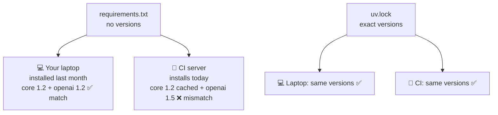
<sub>(Version numbers above are illustrative.)</sub>

**Fix:**
- Use a lock file (`uv lock` produces `uv.lock`) and **commit it**.
- Pin major versions in `pyproject.toml`, e.g. `langchain>=1.0,<2`.
- Run CI with `uv sync --frozen` so it installs **exactly** what you tested.

</details>

---

## 🎤 Interview questions

Answer each one **out loud** before opening the model answer. Levels: 🟢 core · 🟡 tricky · 🔴 senior.

<details>
<summary>🟢 <b>LangChain and LangGraph come from the same company. Why do both exist, and how do they relate today?</b></summary>

LangGraph is the low-level orchestration **runtime**: state, cycles, persistence, streaming, interrupts, durable execution. LangChain is the higher-level developer layer: model and tool interfaces, `create_agent` and middleware. Since 1.0, `create_agent` compiles to a LangGraph graph, so they are **layers, not competitors**.

Rule of thumb: start with `create_agent`. Drop to `StateGraph` when you need custom control flow, deterministic steps mixed with LLM steps, or multi-agent orchestration.

</details>

<details>
<summary>🟡 <b>Isn't LangChain just a thin wrapper? Why not call the provider SDK directly?</b></summary>

For one prompt and one model, calling the SDK directly is fine, and I would say so. The framework pays off when you need: a standard message and tool-call format across providers, model swapping without rewrites, streaming across nested steps, persistence and resume, human approval, and tracing that sees every step. Re-implementing those is where teams burn weeks.

**Good answer shape:** acknowledge the trade-off (abstraction cost, learning curve), then name concrete capabilities you would otherwise have to build.

</details>

<details>
<summary>🔴 <b>A customer says: "your bot gives wrong answers sometimes." Walk me through your first hour.</b></summary>

1. Get concrete failing examples and the expected answers.
2. Find those runs in the traces.
3. Localise by layer: was the input clear, did retrieval return the right context, what did the rendered prompt look like, did tools return correct data, did the graph take the right path.
4. Form one hypothesis and build a minimal reproduction.
5. Fix, then add the failing cases to an eval dataset so it cannot regress.

**What interviewers listen for:** you do *not* start by rewriting the prompt, and you turn anecdotes into a dataset.

</details>

<details>
<summary>🟡 <b>When would you tell a customer they do NOT need an agent?</b></summary>

When the steps are known ahead of time. A fixed pipeline (classify → retrieve → answer, or extract → validate → write to DB) is cheaper, faster, easier to test and more predictable as a workflow. Agents are for tasks where the model must decide which steps to take and how many. Many production systems are workflows with one or two agentic steps inside.

</details>

<details>
<summary>🟢 <b>Does LangSmith require LangChain?</b></summary>

No. LangSmith traces any code: use the `@traceable` decorator or wrap a provider client (for example `wrap_openai`). With LangChain or LangGraph, setting `LANGSMITH_TRACING=true` and an API key traces every step automatically.

</details>

<details>
<summary>🔴 <b>What does a Forward Deployed Engineer do that a regular backend engineer on an AI team might not?</b></summary>

They work inside the customer's context: discover the real workflow, define success metrics with the customer, prototype fast on the customer's data, handle messy integrations and security constraints, deploy into the customer's environment, and own reliability after launch. The technical core is the same; the difference is **owning the problem end to end** and translating between the customer and the product team.

</details>

---

## 📝 Self-check exam

Pass mark: **7 / 10**. Pick your answer, then expand to check.

**1. In LangChain 1.x, what does `create_agent` run on under the hood?**
A) A LangGraph graph · B) The legacy AgentExecutor loop · C) LangSmith Deployment only · D) A plain Python while-loop with no persistence
<details><summary>Answer</summary>

**A.** `create_agent` builds and compiles a LangGraph graph, so checkpointers, streaming and interrupts all work with it.
</details>

**2. Which package holds base abstractions such as `Runnable` and the message classes?**
A) langchain-community · B) langchain-core · C) langsmith · D) langgraph-sdk
<details><summary>Answer</summary>

**B.** `langchain-core` is the dependency-light foundation every other package builds on.
</details>

**3. Your team finds `AgentExecutor` in a 2024 codebase. What is its status in 1.x?**
A) It is the recommended agent · B) It moved to langchain-classic and is deprecated · C) It was renamed to StateGraph · D) It now lives in langsmith
<details><summary>Answer</summary>

**B.** Legacy chains and `AgentExecutor` moved to `langchain-classic`. New work uses `create_agent` or LangGraph.
</details>

**4. Which setting turns on automatic tracing for LangChain and LangGraph code?**
A) `DEBUG=1` · B) `LANGSMITH_TRACING=true` plus `LANGSMITH_API_KEY` · C) `verbose=True` on the model · D) `OPENAI_LOG=debug`
<details><summary>Answer</summary>

**B.** With the tracing flag and an API key set, every run is sent to LangSmith.
</details>

**5. Why are provider integrations shipped as separate packages like `langchain-openai`?**
A) To slow down installs · B) So each integration can version and release independently with its own dependencies · C) Because LangChain cannot import OpenAI otherwise · D) They are not; everything is in one package
<details><summary>Answer</summary>

**B.** Separate packages isolate provider dependencies and let integrations update without a core release.
</details>

**6. A workflow needs loops, a branch that depends on an LLM decision, and a human approval step. What fits best?**
A) A single LCEL pipe · B) A LangGraph StateGraph (or create_agent with HITL middleware) · C) One long prompt · D) A cron job
<details><summary>Answer</summary>

**B.** Cycles, conditional routing and interrupts are exactly what LangGraph's runtime provides. (HITL = human-in-the-loop.)
</details>

**7. An agent misbehaves in production. What should an FDE do first?**
A) Rewrite the system prompt · B) Switch to a bigger model · C) Reproduce with concrete examples and read the traces to localise the failing layer · D) Add more tools
<details><summary>Answer</summary>

**C.** Changing things before localising the failure is guessing. Traces tell you which layer broke.
</details>

**8. Minimum Python version for LangChain 1.x?**
A) 3.8 · B) 3.9 · C) 3.10 · D) 3.13
<details><summary>Answer</summary>

**C.** Python 3.9 support was dropped when preparing 1.0.
</details>

**9. Can LangGraph be used without LangChain?**
A) No, it imports every LangChain chain · B) Yes, it is a standalone runtime; LangChain integrations are optional · C) Only with LangSmith Deployment · D) Only for JavaScript
<details><summary>Answer</summary>

**B.** LangGraph can orchestrate any Python functions, including raw SDK calls.
</details>

**10. Which is the best reason to commit a lock file such as `uv.lock`?**
A) It stores API keys safely · B) It makes CI and teammates install exactly the versions you tested · C) LangChain requires it to run · D) It speeds up the model
<details><summary>Answer</summary>

**B.** Unpinned LangChain ecosystems drift quickly; a lock file makes builds reproducible.
</details>

---

## 🛠️ Milestone project: repo skeleton and sanity check

**Why it matters:** every later milestone builds on this. A clean layout, safe secret handling and working tracing save you hours later.

### Tasks

- [ ] Create the **acme-supportos** repo with `uv init`, a `src/supportos/` package and a committed `uv.lock`.
- [ ] Add `.env.example` with empty values and make sure `.env` is in `.gitignore`.
- [ ] Write `scripts/hello_llm.py` that loads env first, calls the model once, prints `.text` and `usage_metadata`.
- [ ] Turn on LangSmith tracing and add a screenshot or run link of your first trace to the README.
- [ ] Write `notes/module-00.md`: the ecosystem map and the seven debugging layers in your own words.
- [ ] README: setup steps a new teammate can follow in under five minutes.

### Target folder structure

```text
acme-supportos/
├── pyproject.toml        # pinned: langchain>=1,<2 ...
├── uv.lock
├── .env.example
├── .gitignore            # .env, .venv, __pycache__
├── README.md
├── notes/module-00.md
├── scripts/hello_llm.py
└── src/supportos/__init__.py
```

| File / folder | What it's for |
|---|---|
| `pyproject.toml` | Project name, Python version, and dependency ranges. |
| `uv.lock` | Exact versions of every installed package. Commit it. |
| `.env.example` | Template of required environment variables, with empty values. |
| `.gitignore` | Tells git which files never to commit (`.env`, `.venv`, caches). |
| `README.md` | How to set up and run the project. |
| `notes/` | Your own learning notes per module. |
| `scripts/` | Small runnable scripts like the sanity check. |
| `src/supportos/` | The real application code, as an importable package. |

### Grading rubric (10 points)

| Criterion | Points |
|---|---|
| Project layout and dependency pinning | 3 |
| Secrets hygiene (`.env` ignored, example provided) | 2 |
| Working sanity script with usage printed | 2 |
| Quality of module notes | 2 |
| README clarity | 1 |

---

## 📖 Glossary

| Term | Meaning |
|---|---|
| **Agent** | A program where the LLM decides which steps to take (which tools to call, when to stop). |
| **AIMessage** | The message object a chat model returns. Has `.text`, `.tool_calls`, `.usage_metadata`. |
| **API key** | Secret credential that authorises requests to a provider. Never commit it. |
| **Checkpointer** | LangGraph component that saves the state after each step so runs can pause, resume or survive crashes. |
| **CI** | Continuous Integration: a server that installs your project and runs tests automatically on every push. |
| **Content blocks** | 1.x standard format (`message.content_blocks`) for text, reasoning, tool calls and images, the same across providers. |
| **Context window** | Maximum number of tokens a model can read in one call. "Context overflow" = you sent too much. |
| **`create_agent`** | LangChain 1.x's standard function for building an agent. Compiles to a LangGraph graph. |
| **Deep Agents** | A harness on top of LangChain for long, open-ended tasks: planning, virtual files, subagents. |
| **Eval dataset** | A saved set of inputs + expected outputs used to measure quality and catch regressions. |
| **FDE** | Forward Deployed Engineer: builds and owns AI systems inside the customer's context. |
| **Hallucinated arguments** | When the model invents tool inputs that don't exist (a fake order ID, for example). |
| **HITL** | Human-in-the-loop: pausing so a person can approve or edit before the system continues. |
| **`init_chat_model`** | One-line way to create a chat model from a `"provider:model"` string. |
| **Interrupt** | LangGraph's mechanism for pausing a run to wait for outside input (usually a human). |
| **LCEL** | LangChain Expression Language: the `prompt \| model` pipe syntax for simple linear chains. |
| **LangChain** | Library of standard interfaces for models, tools and agents. |
| **langchain-classic** | Package holding legacy 0.x-era chains and `AgentExecutor`. Maintenance only. |
| **langchain-core** | The foundation package: Runnable, messages, prompts, tool schema. |
| **LangGraph** | The runtime that executes graphs of steps with state, persistence, streaming and interrupts. |
| **LangSmith** | Hosted platform for tracing, evaluation, prompt management and deployment. |
| **Lock file** | File (`uv.lock`) recording the exact version of every dependency so installs are reproducible. |
| **Middleware** | Plug-in components that customise an agent's behaviour (summarisation, PII redaction, approval, retries, fallbacks). |
| **Regression test** | A test that ensures a fixed bug never comes back. |
| **Rendered prompt** | The final prompt text after all template variables are filled in — what the model actually saw. |
| **Runnable** | The standard interface in `langchain-core`: anything with `.invoke()`, `.stream()`, `.batch()`. |
| **Semantic versioning** | `MAJOR.MINOR.PATCH`; only a MAJOR bump may break your code. |
| **State** | The data a graph keeps and updates as it moves between steps. |
| **StateGraph** | LangGraph class for defining your own graph of nodes and edges over a shared state. |
| **Temperature** | Randomness setting for the model; `0` = most deterministic. |
| **Token** | Unit of text (≈ ¾ of a word) used for billing and context limits. |
| **Tool** | A function described to the model, which the model can ask your code to run. |
| **ToolMessage** | The message carrying a tool's result back to the model. |
| **Trace** | A recorded tree of every step in one run, with inputs, outputs, timing and tokens. |
| **`uv`** | Fast Python package/project manager that creates environments and lock files. |
| **Virtual environment** | An isolated folder of packages for one project. |

---

## 🗺️ One-page summary

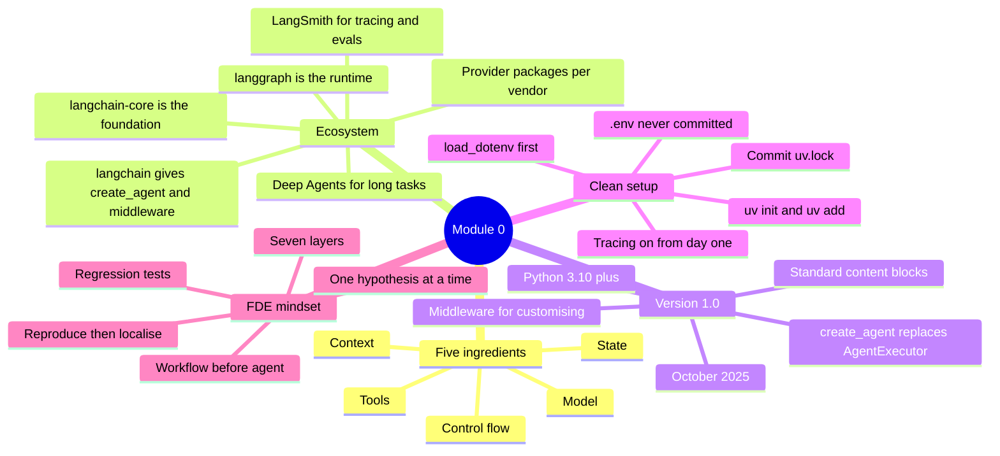

### Five things to remember

1. **LangChain = standard interfaces. LangGraph = the runtime. LangSmith = the eyes.**
2. **`create_agent` compiles to a LangGraph graph**, so learning LangGraph pays off even for one-line agents.
3. **Ignore 2023–2024 tutorials** that import `LLMChain`, `ConversationBufferMemory`, `initialize_agent` or `AgentExecutor`.
4. **Load env first, keep secrets out of git, commit the lock file, and turn tracing on before line two.**
5. **Don't rewrite the prompt first.** Reproduce → localise (seven layers) → hypothesise → isolate → fix → regression test.

---

<div align="center"><sub>Notes for <b>GraphSmith Academy · Module 0</b>. Next up: Module 1 — Chat models and messages.</sub></div>