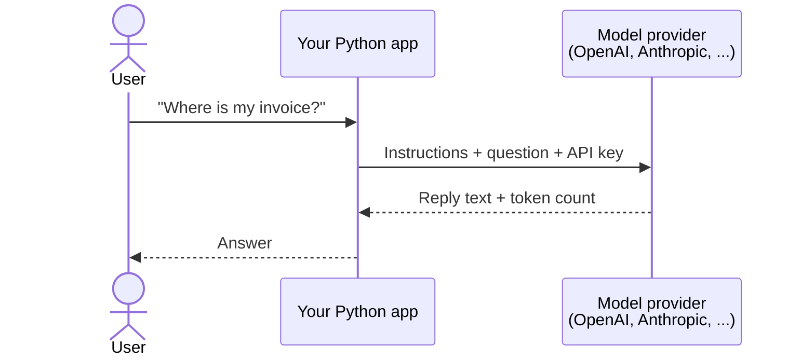
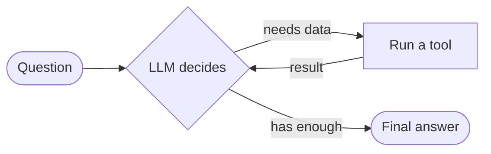
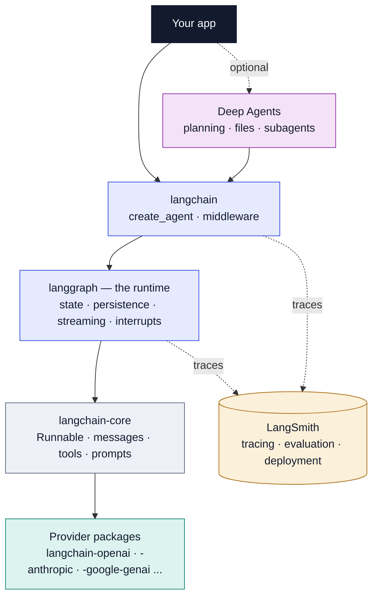
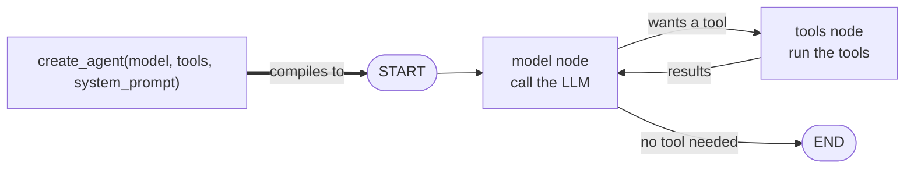
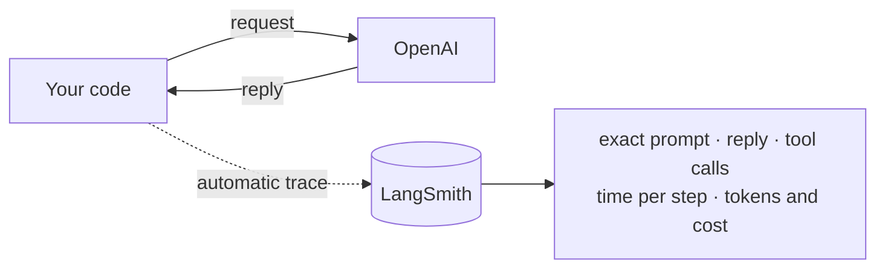
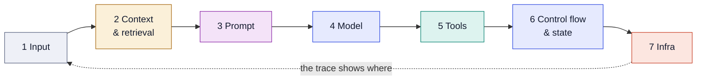
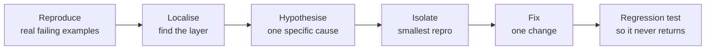

# Module 0 — Orientation: the Ecosystem and the FDE Mindset

**Goal:** know what each LangChain package does, set up a clean project, and learn the seven-layer way of debugging that the rest of the course builds on.

---

## 0.0 The basics in two minutes

**An LLM (Large Language Model)** is a program that reads text and writes text back. GPT, Claude, Gemini and Llama are all LLMs. Picture a very well-read assistant in a closed room. You slide a note under the door and it slides a reply back. It has **no memory** of earlier notes unless you include them again, and it **can't look anything up** unless you hand it the information.

Most LLMs run on the provider's servers. Your code talks to them over the internet through an **API**:



Four words you'll see everywhere:

- **Prompt** — the text you send the model (instructions + question + any data).
- **Token** — a chunk of text, about ¾ of a word. You pay per token, and each model can only read a limited number of tokens at once.
- **API key** — a secret password tied to your paid account. Never share it or put it on GitHub.
- **Temperature** — a randomness dial. `0` gives the most consistent answers.

### Tools and agents

A **tool** is an ordinary function, like `get_invoice(customer_id)`, that you describe to the model. The model can't run code. It *asks* for a tool, your program runs it, and the result goes back to the model.

An **agent** is a program where the **model decides the next step**: call a tool, call another one, or give the final answer.



---

## 0.1 What you are actually learning

Every LLM application, from a simple chatbot to a team of agents, is built from **five ingredients**:

| Ingredient | What it is | Analogy |
|---|---|---|
| **Model** | The LLM that reads and writes | The brain |
| **Context** | What you put in front of the model: instructions, chat history, documents | Papers on the desk |
| **Tools** | Functions the model can ask you to run | The hands |
| **State** | What you remember between steps | The notebook |
| **Control flow** | The logic that decides what happens next | The to-do list |

> [!IMPORTANT]
> **LangChain** gives you **standard interfaces** for those ingredients. **LangGraph** gives you a **runtime** that runs them reliably.

**Why not just call OpenAI's own library directly?** For one prompt to one model, you can. Teams switch to a framework once they need to:

- swap one model provider for another without rewriting code,
- stream words to the screen as they're generated,
- pause and wait for a human to approve an action,
- resume after a crash halfway through a long task,
- find out exactly why one run out of thousands went wrong.

Building all of that yourself takes weeks. The frameworks give it to you.

---

## 0.2 The ecosystem map

"LangChain" is really **a family of separate packages** stacked on top of each other, plus a hosted service called **LangSmith**. Read the solid arrows as *"is built on"*.



From the bottom up:

| Package | What it does | Use it when |
|---|---|---|
| **Provider packages** (`langchain-openai`, …) | Adapters, one per vendor. Each translates that vendor's API into LangChain's standard shape. | You pick a model vendor |
| **`langchain-core`** | The foundation. It defines what a message, a tool and a prompt look like, plus the **Runnable** interface (anything you can `.invoke()`, `.stream()` or `.batch()`). | Always installed; everything depends on it |
| **`langgraph`** | The runtime. It runs your steps as a **graph**, keeps **state**, saves progress, streams output and can **pause** for a human. | You need loops, custom flow, memory or human approval |
| **`langchain`** | The friendly top layer: `init_chat_model` (any model in one line), `create_agent` (an agent in one call) and **middleware** to customise agents. | You want a working agent quickly |
| **`deepagents`** | A ready-made harness for long, open-ended tasks like research or coding. | Tasks with many steps and planning |
| **`langchain-classic`** | Old-style chains and `AgentExecutor`. | Only for maintaining old code |
| **LangSmith** | A website that records every step your app takes, tests quality and deploys. | From day one |

Providers ship as separate packages so each one can update on its own schedule, and you only install what you use.

### The key idea: `create_agent` *is* a LangGraph graph

In LangChain 1.x, `create_agent` **compiles to a LangGraph graph**. That one line builds this for you:



So everything you learn about LangGraph (state, saving progress, streaming) also applies to agents made with one line of LangChain. That's why the course teaches both.

**Rule of thumb:** start with `create_agent`. Write your own LangGraph `StateGraph` only when you need custom control flow, fixed steps mixed with LLM steps, or several agents working together.

---

## 0.3 Versions: what changed with 1.0

LangChain and LangGraph both reached **1.0 in October 2025**. They follow **semantic versioning** (`MAJOR.MINOR.PATCH`), where only a MAJOR change may break your code. So anything you write for 1.0 keeps working across all 1.x releases. By mid-2026, 1.x had added content-block streaming, node timeouts and a delta channel for long threads, all without breaking changes.

What this means for you:

- **`create_agent`** is now the standard agent. It replaced `AgentExecutor` and `create_react_agent`.
- **Middleware** is how you customise an agent: summarising long chats, asking a human for approval, hiding personal data, retrying, or falling back to another model. You plug these in instead of rewriting the agent.
- **Standard content blocks** (`message.content_blocks`) give text, reasoning, tool calls and images the **same shape** whichever provider you use.
- **LCEL pipes** (`prompt | model`) still work, but only for simple straight-line chains. Agents and anything with memory go through LangGraph.
- **Python 3.10 or newer** is required.

> [!WARNING]
> Most tutorials and Stack Overflow answers from 2023–2024 use APIs that have moved or been deprecated, such as `LLMChain`, `ConversationBufferMemory`, `initialize_agent` and `AgentExecutor`. If a snippet imports these, it's outdated. Check the date, and check **docs.langchain.com**.

---

## 0.4 Set up a clean project

The course builds one project throughout: **Acme SupportOS**, a support assistant for a fictional company. For now you only need to create the project and make your first model call.

**1. Create the project and install packages** with `uv`, a fast Python package manager. It keeps this project's packages separate from everything else on your machine, and it records their exact versions in a **lock file** (`uv.lock`).

```bash
uv init acme-supportos && cd acme-supportos
uv add langchain langchain-openai langgraph langsmith python-dotenv
uv add --dev pytest ruff
```

`python-dotenv` reads your settings file. `pytest` (runs tests) and `ruff` (checks code style) are developer-only tools.

**2. Put secrets in a `.env` file.** Your code reads these as **environment variables**, so keys never appear in your source code.

```bash
# .env  (never commit this file; commit .env.example with empty values)
OPENAI_API_KEY=sk-...
LANGSMITH_TRACING=true
LANGSMITH_API_KEY=lsv2_...
LANGSMITH_PROJECT=acme-supportos-dev
MODEL=openai:gpt-4.1-mini
```

`LANGSMITH_TRACING=true` plus a LangSmith key switches on automatic tracing. `MODEL` uses the `provider:model` format, so changing model is a one-line edit.

**3. Make your first call** in `scripts/hello_llm.py`:

```python
from dotenv import load_dotenv
load_dotenv()                      # load keys BEFORE creating any model

import os
from langchain.chat_models import init_chat_model

model = init_chat_model(os.environ["MODEL"], temperature=0)
reply = model.invoke("Say hello to Acme Cloud's support team in one sentence.")
print(reply.text)                  # the plain text
print(reply.usage_metadata)        # input, output and total tokens
```

- `load_dotenv()` **must come first**. The model reads the API key at the moment it's created, so if the key isn't loaded yet, you get an error.
- `init_chat_model(...)` creates a model from the `MODEL` string.
- `.invoke(...)` sends a message and waits for the full reply.
- `reply` is a message object, not a plain string. `.text` gives you the words, and `.usage_metadata` gives you the token count, which tells you the cost.

Run it with `uv run python scripts/hello_llm.py`.

### What LangSmith shows you

With tracing on, every run is recorded as a **trace**: a step-by-step record of what the model received, what it returned, which tools it called, how long each step took and how many tokens it used.



> [!TIP]
> Turn tracing on **before you write your second line of code**. You can't debug what you can't see. LangSmith also works without LangChain: add the `@traceable` decorator to any function, or wrap a provider client with `wrap_openai`.

---

## 0.5 The FDE mindset: seven layers

A **Forward Deployed Engineer (FDE)** works directly with a customer. They turn a vague problem into a working system and keep it running in production. Their key skill is **diagnosis**.

When a customer says *"the bot gives wrong answers sometimes"*, a beginner starts rewriting the prompt. An FDE first asks **"which layer is broken?"** and uses the trace to find out.

Every request passes through seven layers, and a bug can hide in any of them:



| Layer | Typical failure | First thing to check |
|---|---|---|
| **1 · Input** — what the user sent | Unclear or badly formatted input | The raw input in the trace |
| **2 · Context** — documents and history you gave the model | Wrong documents retrieved, history cut off | The documents and messages actually sent |
| **3 · Prompt** — the final text the model saw | Conflicting instructions, no output format | The **filled-in** prompt, not the template |
| **4 · Model** — the LLM and its settings | Too weak for the task, wrong temperature, too much text | The same input on a different model |
| **5 · Tools** — functions the model calls | Vague tool descriptions, made-up arguments, errors | The tool's arguments and returned result |
| **6 · Control flow & state** — which step runs next and what's remembered | Endless loops, wrong branch, overwritten data | The path taken and the state at each step |
| **7 · Infra** — servers, limits, package versions | Rate limits, timeouts, lost memory | Logs, error rates, where state is stored |

Once you know the layer, follow the same loop every time:



Two habits make this work. Turn vague complaints into **concrete examples**, then add those examples to a **test dataset** so the same bug can't quietly come back.

### Not everything needs an agent

Part of the mindset is knowing when **not** to build an agent. If the steps are known in advance (for example, classify the ticket → find documents → write the answer), use a fixed **workflow**. It's cheaper, faster and easier to test. Use an agent only when the model genuinely needs to choose which steps to take and how many. Many real systems are workflows with one or two agent steps inside.

---

## Key takeaways

1. **LangChain** = standard interfaces. **LangGraph** = the runtime. **LangSmith** = visibility into every run.
2. `create_agent` builds a LangGraph graph, so learning LangGraph pays off even for one-line agents.
3. Ignore pre-1.0 tutorials that use `LLMChain`, `initialize_agent` or `AgentExecutor`.
4. Load your `.env` first, keep secrets out of git, and turn tracing on from day one.
5. Don't start by rewriting the prompt. Find the broken layer, fix one thing, and add a test.