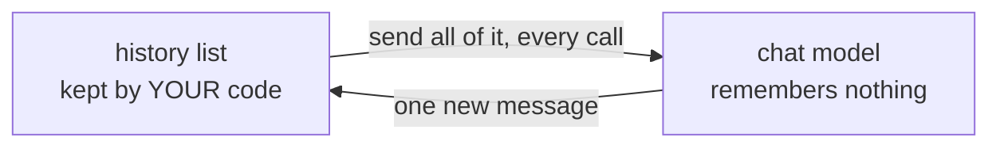
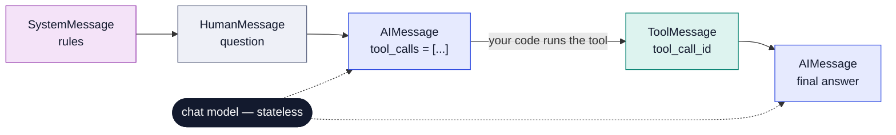
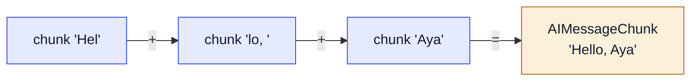
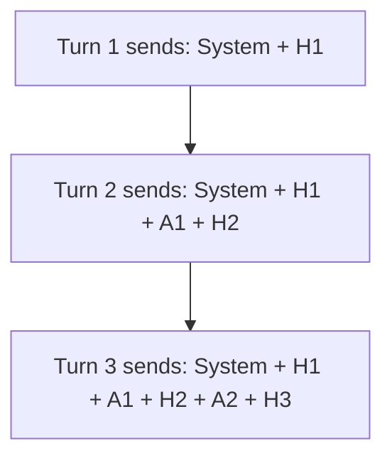

# Module 1 — Chat Models and Messages

**Goal:** treat a chat model as what it really is — a **stateless function from messages to a message** — and control it confidently: providers, settings, streaming, batching, content blocks and token cost.

---

## 1.1 A chat model is a stateless function

> [!IMPORTANT]
> Messages in → **one message out**. Nothing is remembered between calls.

"Stateless" means the model keeps **no memory** from one call to the next. Every call starts from zero.



This single fact explains most "the bot forgot what I said" bugs. If you want the model to know the conversation, **you must send the conversation every time**. Memory is always something your code keeps — or, from Module 9 onwards, something LangGraph keeps for you.

---

## 1.2 Creating a model

```python
from langchain.chat_models import init_chat_model

model = init_chat_model(
    "openai:gpt-4.1-mini",   # "provider:model" — swapping vendors is a config change
    temperature=0,           # lower = less random (NOT fully predictable, see 1.8)
    max_tokens=800,          # maximum length of the reply, in tokens
    timeout=30,              # seconds to wait before giving up
    max_retries=2,           # retry automatically on temporary errors
)
```

| Setting | What it controls |
|---|---|
| `temperature` | How random the wording is. `0` = stick to the most likely words. |
| `max_tokens` | A cap on the **reply** length. It protects you from long, expensive answers. |
| `timeout` | How long one request may take before it's abandoned. |
| `max_retries` | How many times to try again after a temporary failure, such as a network blip or the provider being busy. |

**Two ways to create a model:**

- **`init_chat_model("provider:model")`** — the **portable** choice. The prefix tells LangChain which provider package to load, so moving from OpenAI to Anthropic to a local Ollama model is a one-line change.
- **The provider's own class**, e.g. `ChatAnthropic(model="claude-sonnet-4-5")` — use this only when you need a feature that just that provider has.

---

## 1.3 Messages: the common language

Every conversation is a **list of messages**, and each message has a **role** that says who it's from.

| Type | Role | What it carries |
|---|---|---|
| `SystemMessage` | system | The rules: persona, tone, output format. Goes **first**. |
| `HumanMessage` | user | What the user typed, or images and files they sent. |
| `AIMessage` | assistant | The model's reply: text, **tool calls**, token usage, metadata. |
| `ToolMessage` | tool | The result of running one tool. It must carry the matching **`tool_call_id`**. |

Here is one full turn where the model uses a tool:


<p align="center"><sub>One tool-using turn. The model never remembers; you resend this whole list on every call.</sub></p>

Read it left to right:

1. The model reads the rules and the question.
2. Instead of answering, it replies with a **tool call**: "please run `get_invoice` with these arguments".
3. Your code runs the tool and sends the result back as a `ToolMessage`. The `tool_call_id` says which request this result answers.
4. The model calls again — with the whole list — and writes the final answer.

Writing messages in code:

```python
from langchain.messages import SystemMessage, HumanMessage

msgs = [
    SystemMessage("You are Acme Cloud support. Be brief and friendly."),
    HumanMessage("My name is Aya. How do I reset my API key?"),
]

# The dict shorthand works everywhere too:
msgs = [
    {"role": "system", "content": "You are Acme Cloud support."},
    {"role": "user", "content": "My name is Aya. How do I reset my API key?"},
]

ai = model.invoke(msgs)
```

---

## 1.4 Inside an `AIMessage`

The reply is an object, not a plain string. These are the parts you'll use:

```python
ai.text              # the reply as one plain string — use this for display
ai.content           # the raw provider data: a string OR a list of blocks
ai.content_blocks    # standard typed blocks: text, reasoning, tool_call, image ...
ai.tool_calls        # [{"name": ..., "args": {...}, "id": "call_1", "type": "tool_call"}]
ai.usage_metadata    # {"input_tokens": 41, "output_tokens": 57, "total_tokens": 98}
ai.response_metadata # model name, why it stopped, provider extras
```

### `content` vs `text` vs `content_blocks`

| Attribute | What you get | Use it for |
|---|---|---|
| `content` | The **raw** data, shaped however the provider likes. | Rarely. |
| `text` | One **plain string**. It's a property, so write `ai.text`, not `ai.text()`. | Showing the answer. |
| `content_blocks` | A **standard list of typed blocks** that looks the same for every provider. | When you need structure, such as reasoning or citations. |

The same answer from a reasoning model:

```python
ai.content         # [{'type': 'thinking', 'thinking': '...'}, {'type': 'text', 'text': 'Go to Settings → API keys.'}]
ai.text            # 'Go to Settings → API keys.'
ai.content_blocks  # [{'type': 'reasoning', 'reasoning': '...'}, {'type': 'text', 'text': 'Go to Settings → API keys.'}]
```

> [!WARNING]
> **`content` is not always a string.** Some providers, such as Anthropic and reasoning models, return a **list of blocks**. Code like `reply.content + "!"` works with one provider and crashes with another. Use `reply.text` for display.

---

## 1.5 Four ways to call a model

```python
# 1) invoke — one request, wait for the full answer
ai = model.invoke(msgs)

# 2) stream — get the answer piece by piece as it's written
full = None
for chunk in model.stream(msgs):
    print(chunk.text, end="", flush=True)
    full = chunk if full is None else full + chunk   # chunks add up

# 3) batch — many separate questions, run at the same time
answers = model.batch(
    [[HumanMessage(q)] for q in questions],
    config={"max_concurrency": 5},    # at most 5 requests at once
)

# 4) async versions for web servers: ainvoke / astream / abatch
ai = await model.ainvoke(msgs)
```

### Streaming

The answer arrives in small pieces called `AIMessageChunk`. Users see words appearing straight away instead of waiting for the whole reply, so the app *feels* much faster.

Chunks can be **added with `+`**. Adding all of them rebuilds the complete message, including the token usage, which usually arrives on the last chunk.


<p align="center"><sub>Streaming returns AIMessageChunk objects. Adding the chunks rebuilds the full message.</sub></p>

### Batch

`batch` sends many **independent** inputs at the same time from your machine. It is **not** the provider's discounted "Batch API", which is a separate, cheaper overnight service.

Always set `max_concurrency`. Without it, a large batch fires too many requests at once and the provider starts rejecting them with **HTTP 429** ("too many requests", also called a rate-limit error).

### Async

`ainvoke`, `astream` and `abatch` do the same jobs, but let a web server handle other users while it waits for the model. You'll use them when you build an API. For scripts, the normal versions are fine.

---

## 1.6 Conversation memory by hand

Because the model is stateless, memory is just a list you keep and resend:

```python
history = [SystemMessage("You are Acme Cloud support.")]

while True:
    user = input("you> ")
    history.append(HumanMessage(user))
    ai = model.invoke(history)
    history.append(ai)          # keep the reply too, or the model loses its own words
    print("bot>", ai.text)
```

The two `append` lines are the whole trick, and `history` must be created **outside** the loop.

This works, but it reveals the cost problem: **every turn resends the whole history**, so input tokens grow with every message. Later modules fix this — Module 6 trims or summarises old messages with middleware, and Module 9 lets LangGraph store history for you.

---

## 1.7 Tokens, context windows and cost

- **Tokens** are pieces of words. English averages about **4 characters per token**.
- The **context window** is the maximum number of tokens (input + output) a model can handle in one call. Go over it and the provider returns an error.
- **Cost = input tokens × input price + output tokens × output price.** Output tokens usually cost several times more than input tokens.
- **Prompt caching:** if the start of your request is identical every time (same system prompt, same tool list), providers can reuse their earlier work on it. That cuts both cost and waiting time, so keep that opening part stable.

### Why a conversation gets more expensive every turn



Turn 3 pays again for everything in turns 1 and 2. A long chat doesn't just add cost — each new turn costs **more than the one before**.

> [!TIP]
> **FDE habit:** log `usage_metadata` for every request from day one. When a customer asks why the bill tripled, you want the answer in minutes, not a week.

---

## 1.8 Reliability settings

Real providers sometimes slow down, fail or reject requests. Three tools help:

```python
from langchain_core.rate_limiters import InMemoryRateLimiter

# 1) Rate limiter: never send more than 2 requests per second
limiter = InMemoryRateLimiter(requests_per_second=2, max_bucket_size=5)

# 2) Timeout + retries: give up after 30s, retry up to 3 times
model = init_chat_model("openai:gpt-4.1-mini", rate_limiter=limiter,
                        timeout=30, max_retries=3)

# 3) Fallback: if the first provider errors, try another one
backup = init_chat_model("anthropic:claude-haiku-4-5")
robust = model.with_fallbacks([backup])
```

| Tool | Problem it solves |
|---|---|
| **Rate limiter** | Keeps you under the provider's request limit, so you don't get 429 errors. |
| **Timeout** | Stops one slow request from freezing your app. |
| **Retries** | Recovers from temporary failures automatically. |
| **Fallbacks** | Keeps the app working when one provider is down. |

### Is `temperature=0` fully predictable?

**No.** It makes the model choose the most likely words, but the output can still vary between runs — because of how the provider groups requests on its hardware, and because of model updates.

If you need reliable behaviour, don't depend on temperature alone. Use:

- **structured output** — making the model fill in a fixed format (Module 2),
- **validation** — checking the answer in code,
- **evaluations** — automated tests of answer quality.

---

## Key takeaways

1. A chat model is **stateless**: messages in, one message out. Memory is a list **you** keep and resend.
2. Use **`init_chat_model("provider:model")`** so switching vendors is a config change.
3. Four message types: **System** (rules), **Human** (user), **AI** (reply and tool calls), **Tool** (tool result, linked by `tool_call_id`).
4. Display with **`ai.text`**, use **`content_blocks`** for structure, and avoid relying on raw `content`.
5. **`stream`** for responsiveness (chunks add up with `+`), and **`batch`** with `max_concurrency` for many inputs.
6. Cost grows every turn because **the whole history is resent**. Log `usage_metadata` from day one.
7. Use timeouts, retries, rate limiters and fallbacks for reliability. `temperature=0` reduces randomness but doesn't make output predictable.